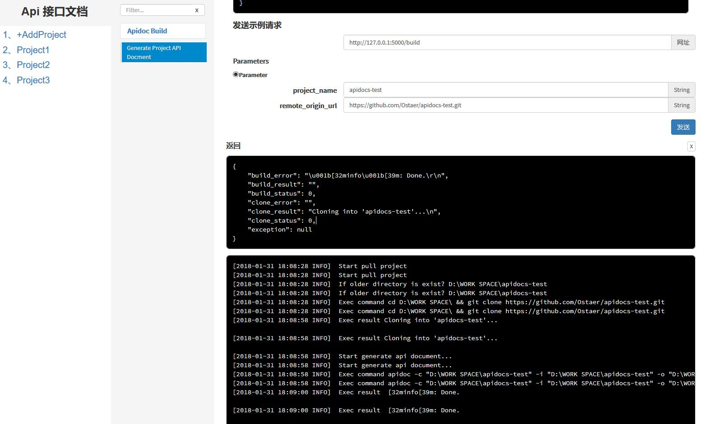

apidoc_py
=====
#### 使用flask扩展开发apidoc，支持api文档的在线浏览、远程构建和自动构建等功能

依赖环境
--------
```
Python > 3.x.x  
    flask   
nodejs > 8.x.x  
    apidoc
git
```


------
#### 1. 运行方式
需要自定义自己的配置

```
{
  "name": "Flask REST API",
  "version": "1.0.0",
  "description": "A Flask REST API example",
  "title": "A Flask REST API example",
  "url" : "http://127.0.0.1:5000",
  "sampleUrl" : "http://127.0.0.1:5000"
}
```
执行配置命令

```
python manage.py config
```

启动命令

```
python manage.py run 0.0.0.0:80
```


#### 2. 项目目录结构：
```
├── config
│   ├── nginx
│   │   └── conf.d
│   │       └── apidoc_py.conf
├── logs
│   └── uwsgi.log
├── README.md
└── src
    ├── app.py
    ├── build.py
    ├── env.conf # code local storage location
    ├── services
    │   ├── BuildService.py
    │   ├── ConfigService.py
    │   ├── IndexService.py
    │   ├── CodeService.py    
    │   ├── exec_command.py    
    │   ├── loggingcus.py    
    │   └── __init__.py
    ├── static
    │   ├── apidocs
    │   │   └── +AddProject
    │   ├── css
    │   │   └── index.css
    │   └── js
    │       ├── index.js
    │       └── lib
    │           └── jquery-1.9.1.min.js
    └── templates
        └── index.html
```
#### 3. 变更部分
修复部分bug

去除一些功能

增加从git拉取代码生成文档功能



